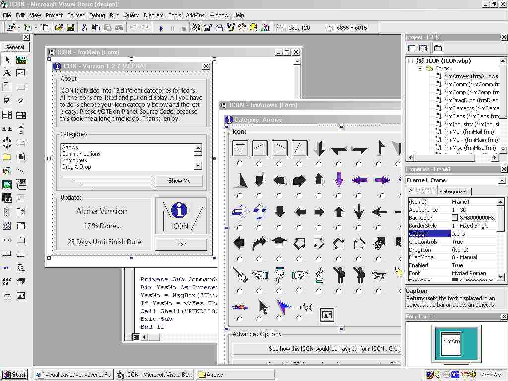



## ICON Chooser \- Over 300 Icons To Choose\!\!

### Description

This is the first version of ICON. ICON is a program that will provide you icons and allow you to choose some from it for your program. This program is in the early, early stages so dont expect something extreme. ONLY ONE category of icons is accessible, that category is called "Arrows" .. I am begging you to vote for my code.. If I get ATLEAST 5 excellent votes, I will continue making the program and I'll make it better. And please read the README.txt file included, because it may help you with extracting information.. Thanks, Enjoy!
 
### More Info
 

             |
---                |---
**Submitted On**   |1998-04-24 00:00:00
**By**             |[RyanConard](https://github.com/Planet-Source-Code/PSCIndex/blob/master/ByAuthor/ryanconard.md)
**Level**          |Intermediate
**User Rating**    |4.4 (44 globes from 10 users)
**Compatibility**  |VB 5\.0, VB 6\.0
**Category**       |[Coding Standards](https://github.com/Planet-Source-Code/PSCIndex/blob/master/ByCategory/coding-standards__1-43.md)
**World**          |[Visual Basic](https://github.com/Planet-Source-Code/PSCIndex/blob/master/ByWorld/visual-basic.md)
**Archive File**   |[ICON\_Choos923316102002\.zip](https://github.com/Planet-Source-Code/ryanconard-icon-chooser-over-300-icons-to-choose__1-35667/archive/master.zip)

